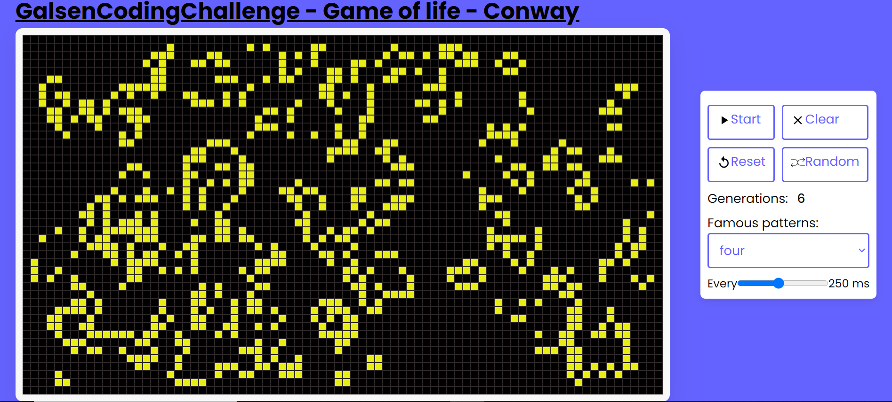

# GalsenCodingChallenge - Jeu de la vie Conway

Implémentation du jeu de la vie de conway dans le cadre du [#GalsenCodingChallenge](https://twitter.com/eliaswalyba/status/1724460346155340047)

Sommaire
- [Technologies utilisées](#Technologies-utilisées)
- [Fonctionalités](#Fonctionalités)
- [Approche technique](#Approche-technique)
- [Tester le jeu](#tester-le-jeu)
- [Auteur](#auteur)

## Technologies utilisées

Solution web avec : 

- HTML
- CSS 
- Javascript

## Fonctionalités

- L'utilisateur peut choisir de demarrer la simulation de la situation de depart en appuyant sur **Start** directement. le schémas de départ par défaut utilisé est le schémas : exploder

- Le bouton **Clear** permet d'effacer le schémas en cours et et de cliquer sur les cellules pour faire son schémas personalisé avant de demarrer avec **Start**

- En appuyant sur **Start** la simulation s'observe sur l'ecran. Le boutton 'Start' se transforme en 'Stop'

- le Bouton **Stop** permet de mettre en pause la simulation.

- Le bouton **Reset** permte de tout arreter et de revenir sur la situation de depart.

- Le Menu déroulant qui se situe en bas du bouton **Clear** permet de choisir parmis des motifs trés célébres du jeu de la vie de Conway.

- L'utilisateur a aussi la possibilité de controller la vitesse de simulation

## Approche technique

- J'ai intégrer quelques motifs trés connus pour le jeu de la vie de Conway.
- J'ai choisi dans mon approche de limiter le nombre maximal de generations a 500 parce que ma programme calcul
et stock dabord dans un tableau les futures générations à partir d'une situation donnée avant de lancer la simulation.
- La grille est de taille 80/45 pour garder un proportion de 16/9 à l'écran.
- Au demarrage de la simulation, une génération est afficher toutes les 300ms.

## Tester le jeu

Pour tester le jeu vous pouvais soit:
- le télécharger depuis github et ouvrir le fichier index.html dans un navigateur oubien
- suivre [ce lien](https://game-of-life-Conway-sn-dev.netlify.app/) vers le site web

## Auteur

Maodo DIOP

Etudiant :
- licence 3 Bid Data à DIT (Dakar Institute of Technology)
- license 3 Maths Appliquées à l'UGB de Saint-Louis/Senegal

Contact : maodo2000diop@gmail.com